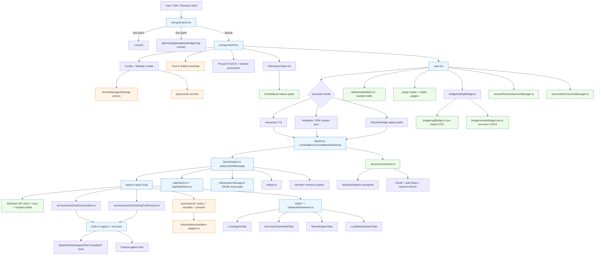

# Claude Code CLI Runtime: Deep Reverse-Engineering Analysis

**Author:** Lakshmikanthan K (letchupkt)  
---

## Executive Overview

I reverse-engineered this codebase as a large-scale TypeScript/Bun runtime for an AI coding assistant CLI that supports:

- Interactive TUI usage
- Headless/SDK streaming workflows
- Remote and bridge-controlled sessions
- Multi-agent/background task execution
- MCP (Model Context Protocol) tool federation
- Enterprise policy and managed settings enforcement

The system is significant because it is not a thin CLI wrapper. It is a full execution platform with its own:

- Stateful runtime kernel (`bootstrap/state.ts`)
- Permission/sandbox policy engine
- Agent/task orchestration fabric
- Pluggable skill/plugin/MCP extension model
- Remote-control control plane (bridge + direct connect)

---

## System Architecture

### High-Level Architecture

At runtime, the architecture is layered:

1. Entry and dispatch layer (`entrypoints/cli.tsx`) for ultra-fast mode routing.
2. Initialization layer (`entrypoints/init.ts`) for trust/config/network/telemetry bootstrapping.
3. Session runtime layer (`main.tsx` and `cli/print.ts`) for interactive/headless conversation loops.
4. Query and tool execution engine (`query.ts`, `QueryEngine.ts`, `services/tools/*`).
5. Integrations layer (MCP, plugins, skills, remote bridge, direct connect).
6. Persistence/state layer (session transcripts, history, settings, caches, metrics).

### Complete Architecture (Mermaid)

### Core Entry Points

- `entrypoints/cli.tsx`: boot dispatcher with aggressive fast-path routing and dead-code-eliminated feature branches.
- `entrypoints/init.ts`: one-time memoized runtime initializer.
- `main.tsx`: primary CLI orchestration and mode selection.
- `cli/print.ts`: streaming/control runtime for interactive and SDK-like flows.
- `entrypoints/mcp.ts`: standalone MCP server runtime.

### Data and Control Flow

- User input/SDK events enter `print.ts`.
- `QueryEngine` constructs turn context and invokes `query.ts` generator loop.
- `query.ts` streams assistant tokens, executes tool-use blocks, and handles compaction/recovery transitions.
- Tool calls route through orchestration with concurrency partitioning and context mutation.
- State and transcript writes are continuously synchronized via AppState + JSONL persistence.

---

## Internal Systems & Modules

### 1. Entrypoint and Boot Modules

| Module | Responsibility |
|---|---|
| `entrypoints/cli.tsx` | Fast-path command dispatch, feature-gated startup routes (bridge, daemon, bg, templates, workers). |
| `entrypoints/init.ts` | Config enablement, safe env application, trust-sensitive setup, network/mTLS/proxy setup, telemetry prep. |
| `main.tsx` | Full CLI command-line behavior, mode setup, policy checks, tool/command pool composition. |

### 2. Query Runtime

| Module | Responsibility |
|---|---|
| `query.ts` | Core turn state machine, tool/result pairing, token-budget logic, compact/recovery controls, stop-hooks. |
| `QueryEngine.ts` | Session-scoped wrapper around query loop for headless/SDK style usage and state carry-over. |
| `query/config.ts`, `query/deps.ts` | Dependency injection and runtime config assembly for testability/fallbacks. |

### 3. Tooling System

| Module | Responsibility |
|---|---|
| `tools.ts` | Canonical tool registry and capability filtering by environment/feature gates/permissions. |
| `Tool.ts` | Tool contracts, tool permission context, execution context, schemas and runtime invariants. |
| `services/tools/toolOrchestration.ts` | Serial vs concurrent tool partitioning using tool-level `isConcurrencySafe`. |
| `services/tools/StreamingToolExecutor.ts` | Streaming-time tool scheduling, cancellation, sibling abort behavior, ordered result yielding. |

### 4. Command System

| Module | Responsibility |
|---|---|
| `commands.ts` | Command registry, internal-only command partitioning, dynamic command loading from skills/plugins. |
| `commands/*` | Built-in slash command implementations, including gated/internal operations. |

### 5. Agent and Task Subsystem

| Module | Responsibility |
|---|---|
| `tasks/*` | Multiple task backends (local agent, in-process teammate, remote agent, local main-session). |
| `utils/task/framework.ts` | Shared lifecycle, polling, output offset tracking, SDK/task notification bridging. |
| `coordinator/coordinatorMode.ts` | Coordinator-mode behavioral contract and worker-prompt governance. |

### 6. State Management

| Module | Responsibility |
|---|---|
| `bootstrap/state.ts` | Global runtime singleton state (session, telemetry counters, feature latches, prompt metadata). |
| `state/store.ts` | Minimal immutable store primitive with `onChange` hooks. |
| `state/AppStateStore.ts` | Full UI/runtime app state schema including tasks, MCP, plugins, bridge statuses. |
| `state/onChangeAppState.ts` | Side-effect bridge from state transitions to persisted settings/metadata notifications. |

### 7. Bridge, Remote, and Direct Connect

| Module | Responsibility |
|---|---|
| `bridge/bridgeMain.ts` | Remote-control bridge orchestration (environment/session lifecycle). |
| `bridge/replBridge.ts` | Env-based REPL bridge transport and event forwarding. |
| `bridge/remoteBridgeCore.ts` | Env-less CCRv2 bridge path (session-ingress direct mode). |
| `remote/RemoteSessionManager.ts` | Client-side remote session coordinator with permission request loop handling. |
| `server/directConnectManager.ts` | Direct websocket control channel manager and permission response protocol. |

### 8. MCP Integration Layer

| Module | Responsibility |
|---|---|
| `services/mcp/client.ts` | MCP transport/client manager, auth, tool/resource exposure, retries/session-expiry handling. |
| `entrypoints/mcp.ts` | Exposes local tools via MCP server endpoint. |
| `services/mcp/config.ts` | MCP config parsing, filtering, policy controls, server signature logic. |

### 9. Skills and Plugins

| Module | Responsibility |
|---|---|
| `skills/loadSkillsDir.ts` | Skill discovery and frontmatter parsing from project/user/policy/plugin sources. |
| `skills/bundled/index.ts` | Built-in skill registration with gate-dependent additions. |
| `utils/plugins/pluginLoader.ts` | Plugin fetch/load/validation/cache/versioning and seed-cache probing. |
| `plugins/builtinPlugins.ts` | Toggleable built-in plugin registry. |

### 10. Memory and Persistence

| Module | Responsibility |
|---|---|
| `memdir/*` | Persistent memory prompt shaping, index truncation, and memory file scanning/retrieval. |
| `utils/sessionStorage.ts` | JSONL transcript chain management, sidechain/subagent transcripts, compaction boundaries. |
| `history.ts` | Cross-session command/paste history with hash-backed large payload storage. |
| `cost-tracker.ts` | Session/project cost and usage accounting with model-level breakdowns. |

---

## Advanced / Hidden Features

This codebase heavily uses build-time feature gates (`feature('...')`) and runtime config toggles.

### Gate Families Observed

- Core runtime modes: `KAIROS`, `COORDINATOR_MODE`, `PROACTIVE`, `DAEMON`, `BG_SESSIONS`
- Remote/control-plane: `BRIDGE_MODE`, `DIRECT_CONNECT`, `SSH_REMOTE`, `UDS_INBOX`, `CCR_MIRROR`
- Context management: `REACTIVE_COMPACT`, `CONTEXT_COLLAPSE`, `HISTORY_SNIP`, `CACHED_MICROCOMPACT`, `TOKEN_BUDGET`
- Tooling/automation: `AGENT_TRIGGERS`, `WORKFLOW_SCRIPTS`, `MONITOR_TOOL`, `WEB_BROWSER_TOOL`
- Memory/skills: `TEAMMEM`, `EXPERIMENTAL_SKILL_SEARCH`, `SKILL_IMPROVEMENT`, `RUN_SKILL_GENERATOR`
- Security/classification: `TRANSCRIPT_CLASSIFIER`, `BASH_CLASSIFIER`, `HARD_FAIL`
- Sync/policy: `UPLOAD_USER_SETTINGS`, `DOWNLOAD_USER_SETTINGS`

### Notable Internal Mechanisms

- Dead-code elimination strategy using inline `feature(...)` checks and lazy `require(...)` to minimize external builds.
- Fast-path CLI routing avoids loading heavy modules for simple invocations.
- Dual bridge architecture: environment-based and env-less CCRv2 paths coexist.
- Internal-only command/tool sets are explicitly separated (`INTERNAL_ONLY_COMMANDS`, ant-only imports).
- Mirrored source tree (`src/` duplicate) is used alongside root imports (`from 'src/...')`, indicating build/path-alias packaging behavior.

---

## Agent / Automation Systems

### Multi-Agent Model

The runtime supports multiple task execution types:

- Local background agents (`LocalAgentTask`)
- In-process teammates (`InProcessTeammateTask`)
- Remote agents (`RemoteAgentTask`)
- Backgrounded main session (`LocalMainSessionTask`)

### Orchestration Behavior

- Task states are tracked in AppState with explicit lifecycle statuses.
- Task output is persisted to per-task files and read incrementally via offsets.
- Completion is surfaced through XML-tagged notifications and SDK events.
- Coordinator mode defines strict delegation semantics and worker communication contract.

### Parallelism

- Tool-level parallelism is controlled by `isConcurrencySafe` and dynamic partitioning.
- Streaming executor permits concurrent safe tools while preserving deterministic output order.
- Sibling cancelation logic prevents long-tail runaway when one concurrent path fails.

---

## Tooling & Infrastructure

### Internal Tooling

- Strongly typed tool contracts with zod schemas.
- Dynamic tool pool assembly based on permission mode, policy, feature gate, environment, and agent mode.
- MCP tools are bridged into the same selection pipeline as built-in tools.

### External Integrations

- Anthropic API request/stream loop with retry and fallback handling.
- MCP transports: stdio, SSE, streamable HTTP, WebSocket.
- OAuth/API-key mixed auth model.
- GrowthBook-driven capability rollout.
- OpenTelemetry/first-party event logging.

### CLI Surface

- Extremely broad command surface in `commands.ts`.
- Distinct remote-safe and bridge-safe command filtering.
- Supports both interactive UI and structured non-interactive JSON-stream protocol.

---

## Memory / State Management

### State Model

- Global singleton runtime state in `bootstrap/state.ts` for cross-module counters/flags/latches.
- Reactive AppState for UI/task/plugin/mcp/bridge statuses.
- Light store abstraction with immutable update pattern.

### Persistence

- Session transcripts in JSONL with parent UUID chaining.
- Subagent transcripts in sidechain directories.
- Per-project and global history stores.
- Project-level persisted cost stats.
- Cached remote managed settings and policy limits with background polling.

### Background Processing

- Cleanup registry coordinates graceful shutdown hooks.
- Background polling for policy and remote settings refresh.
- Optional background housekeeping for memory extraction and protocol registration.

---

## Security & Permissions

### Access Control and Safeguards

- Trust boundary enforced in onboarding flow before full env application.
- Granular permission model with allow/deny/ask rules per source.
- Managed policy support can force managed-only domains/read paths.
- Sandbox adapter integrates filesystem/network restrictions from settings + permission rules.
- Protective deny-write defaults include settings files and sensitive `.claude/skills` paths.

### Runtime Security Controls

- Permission prompts can be hook/classifier mediated.
- Denial-tracking fallback prevents classifier-only deadlocks by reintroducing prompts.
- Policy-limits service gates sensitive features (such as remote control) at org level.
- Remote/session permission requests use explicit control protocol messaging.

### Risk Classification (Observed Attack Surfaces)

- High-risk surfaces: shell execution tools, plugin loading, MCP external servers, remote bridge controls.
- Medium-risk surfaces: persistent memory files, session resume/replay paths, policy cache staleness windows.
- Mitigations present: trust dialog, sandboxing, managed settings precedence, explicit allowlists, deny-write controls, auth refresh and token scoping.

---

## Design Patterns & Engineering Decisions

### Patterns Used

- Feature-gated modular architecture with dead-code elimination.
- Lazy-loading of heavy subsystems to optimize startup latency.
- Event-driven streaming pipeline (messages, tool progress, control requests).
- Functional state transitions and immutable updates.
- Protocol-adapter pattern for MCP/bridge/remote transports.

### Why These Choices Work

- Startup responsiveness is prioritized via dynamic imports and fast-path entry dispatch.
- Runtime extensibility is achieved through tools/commands/skills/plugins as independently composable registries.
- Operational safety is embedded via trust + permission + sandbox + policy-limits layered checks.
- Scalability to complex agent workflows is supported by a dedicated task framework rather than ad-hoc async calls.

### Trade-offs

- Complexity is very high due to gate combinatorics and dual-path runtime behavior.
- Global singleton state increases coordination power but raises coupling and testing overhead.
- Mirrored source layout and path aliasing improve packaging flexibility but increase navigation ambiguity.

---

## Key Insights

1. This is effectively an AI execution OS, not only a terminal chatbot.
2. The bridge subsystem is sophisticated and supports multiple backend protocols and failover styles.
3. Tool execution is engineered for controlled concurrency with deterministic message semantics.
4. Security design is layered and practical: trust gating, policy-gating, rule-based permissions, and sandbox runtime.
5. The extension surface (skills/plugins/MCP) is first-class and deeply integrated into command/tool orchestration.
6. Context and memory management are treated as core systems with compaction, snipping, and typed memory workflows.

---

## Conclusion

From my reverse-engineering, this codebase is a mature, production-grade runtime with enterprise-aware controls, deep extensibility, and robust multi-mode execution paths. The strongest engineering qualities are:

- Explicit subsystem boundaries (entry/init/query/tools/tasks/bridge)
- Operational resilience (retry, fallback, background polling, cleanup hooks)
- Security-first runtime decisions at multiple layers

Primary future improvements I would prioritize:

1. Reduce cognitive complexity from feature-gate branching by formalizing capability profiles.
2. Further decouple global state into domain stores to improve test isolation.
3. Consolidate mirrored source layout clarity with explicit build/docs metadata for contributors.

